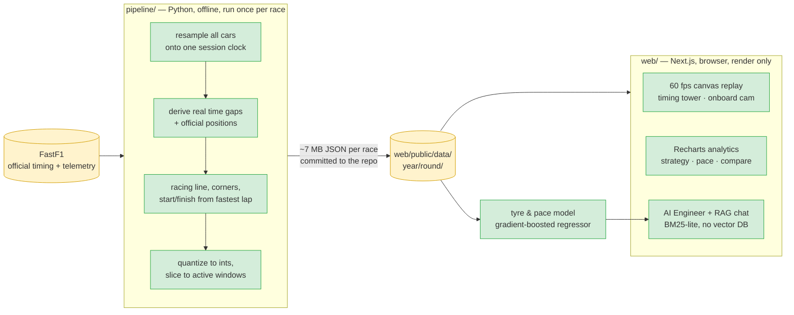

# Apex — F1 Telemetry Replay & Analytics

**A 90-minute Grand Prix of 20 cars' telemetry is gigabytes of data a browser
can't fetch or compute on — Apex moves the expensive, correctness-sensitive
work into an offline pipeline so the browser only ever renders.**

A broadcast-style Formula 1 race replay and analytics studio built on real
[FastF1](https://docs.fastf1.dev/) telemetry. Scrub through a race with a live
timing tower, then dig into tyre strategy, the position-change story, and
distance-aligned driver-vs-driver telemetry.

---

## Architecture



`src/` holds the original pygame desktop replay the project grew out of, still working.

---

## The key design decision: precompute everything, ship JSON

**The alternative I rejected:** a live API the front-end queries per frame —
fetch telemetry on demand, compute gaps and positions server-side as the user
scrubs.

**Why it loses:** FastF1 can't run in a browser, so the choice is really *where*
the computation lives, and a per-frame server round-trip is fatal for a 60 fps
scrub. Worse, gap computation isn't a per-frame operation at all — deriving a
true time gap requires knowing when the car *ahead* passed the position the car
behind now occupies, which needs the whole session resampled onto one clock.
Doing that per request means recomputing a race-wide structure on every frame,
and adds a server that must stay running for a fundamentally static artifact.

**What Apex does instead:** the pipeline does the race-wide work once, quantizes
to integers, slices each driver's data to their active window, and emits JSON.
The front-end is a pure renderer over static files, so the deployed site is
static hosting with no backend, and scrubbing is instant because every frame is
already in memory.

**What it costs, honestly:** race data is baked at export time, so adding a race
means re-running the pipeline and redeploying — there's no live/in-progress race
support, and a pipeline bug means re-exporting everything. The JSON is also
committed to the repo, which is why it carries ~130 MB. For a finished-race
archive that's the right trade; for live timing it would be the wrong one.

### Getting the racing maths right

The precompute is only worth it if the numbers are correct rather than eyeballed:

| Concern | Naive approach | What this does |
| --- | --- | --- |
| **Time gaps** | `metres_behind / 70` | Resample every car onto one shared session clock, then derive the gap as *the time when the car ahead passed the position the car behind is now at* — the same thing a real timing screen computes. |
| **Track position** | sort by distance | Use FastF1's official per-lap `Position`, with cumulative-distance sorting only for the live replay order. |
| **The track** | hard-coded outline | Racing line + corner numbers + start/finish taken from the session's fastest lap and `circuit_info`. |
| **Lap comparison** | overlay vs time | Distance-aligned delta time: integrate `dx / v(x)` along the lap so the two cars are compared at the same point on track. |

---

## Measured result

Measured **2026-08-05**.

**The compression the precompute buys** — across the 19 races committed to the repo:

| Metric | Result |
|---|---|
| Races exported | **19** |
| JSON per race | **5–9 MB** (median 7 MB) |
| Total committed data | 130 MB |

Each race is a full session of 20 cars' telemetry, quantized to integers and
sliced to each driver's active window. Verify with `du -sh web/public/data/*/*`.

**The grounded-chat eval** — `npm run eval:strategist` scores the RAG strategist
against hand-labelled questions per race, RAGAS-style:

```
2019 r11  (5 Qs)  recall@6 100%  accuracy 100%  faithfulness 1.00
2021 r22  (5 Qs)  recall@6 100%  accuracy 100%  faithfulness 1.00
2022 r13  (5 Qs)  recall@6 100%  accuracy 100%  faithfulness 1.00
2023 r20  (5 Qs)  recall@6 100%  accuracy 100%  faithfulness 1.00
2024 r21  (5 Qs)  recall@6 100%  accuracy 100%  faithfulness 1.00

OVERALL   recall@6 100%  accuracy 100%  faithfulness 1.00  (n=25)
```

**Honest caveat:** n=25 is a small, hand-written question set, and a perfect score
across every metric means the questions sit comfortably inside what the retriever
handles — it demonstrates the fact-card retrieval and citation plumbing work end
to end, not that the system is robust to adversarial questions. A larger and
deliberately harder set is the next step.

**Strategy-engine sanity check:** on 2021 Abu Dhabi the AI Engineer independently
reproduces Verstappen's three stops, including the lap-54 switch to softs,
without being told the actual strategy.

---

## Run it in under 2 minutes

The exported race data is **committed to the repo**, so no Python and no
telemetry download are needed to see the app:

```bash
cd web
npm install
npm run dev        # http://localhost:3000
```

The landing page lists all 19 exported races. Any moment is shareable — the
**Share** button copies a deep link restoring the exact tab, time, focused driver
and camera (e.g. `/race/2021/22?t=4860&d=VER&cam=1`).

---

## The app

- **Replay** — canvas track render with the racing line, numbered corners and
  start/finish; team-coloured cars with speed-weighted comet trails and DRS
  markers; a live timing tower with real gap/interval (and "+1 lap" for lapped
  cars); F1-TV-style telemetry bars for the car you click to focus, plus a live
  ahead/behind battle readout. An **onboard** mode zooms and follows the focused
  car. The scrub bar overlays **race-control bands** (safety car / VSC / yellow /
  red) and clickable **key-moment markers** (pit stops, lead changes, fastest
  lap), with a live **flag + weather** readout. Transport controls + keyboard
  shortcuts (`Space`, `←/→`, `r`).
- **Strategy** — every driver's race as a tyre-stint timeline, ordered by
  finishing position, with pit stops as the breaks between compounds.
- **Pace** — a **mini-sector dominance** map (the lap split into 20 sectors,
  the track shaded by who's quickest through each), the race as a
  position-change "spaghetti" chart, and a gap-to-leader evolution chart.
- **Compare** — pick two drivers for a distance-aligned delta-time curve and
  overlaid speed/throttle traces from their quickest laps.
- **AI Engineer** — an independent strategist makes pit calls lap by lap (tyre
  life, pit loss, undercuts, box-under-safety-car) and is graded against what
  each driver actually did, with reasons and a verdict. Decisions are
  deterministic and reproducible; set `GROQ_API_KEY` to have **Llama** (Groq's
  free tier) write the verdicts. On 2021 Abu Dhabi the engine independently
  reproduces Verstappen's three stops, including the lap-54 switch to softs.
- **Tyre & pace model** — a gradient-boosted regressor (scikit-learn) trained on
  every exported race's green-flag laps predicts lap-time pace from tyre age,
  fuel load and track temp. The AI Engineer tab shows a model card (MAE / R²),
  the learned tyre-age curves, feature importance (track temp and fuel dominate;
  tyre age is secondary), and an Evidently-style **data-drift** check across
  races. Train with `python -m pipeline.train_model`.
- **Ask the Strategist** — a retrieval-augmented chat grounded in the race data.
  Each race is turned into fact-cards; a BM25-lite hybrid retriever (no vector
  DB) finds the relevant ones and an LLM answers **with citations** back to laps
  and drivers — falling back to a deterministic extractive answer with no key. A
  RAGAS-style eval (`npm run eval:strategist`) scores context-recall, answer
  accuracy and faithfulness (currently 100% / 100% / 1.00 across the seed races).

---

## Exporting more races

The 19 committed races cover the quick start; the pipeline adds any other:

```bash
python -m venv venv && source venv/bin/activate
pip install -r requirements.txt

# Downloads telemetry (cached after first run) and writes web/public/data/<year>/<round>/
python -m pipeline.export --year 2021 --race "Abu Dhabi"
python -m pipeline.export --year 2023 --race "Brazil"

# optional: AI Engineer verdicts written by Llama (Groq free tier)
export GROQ_API_KEY=...   # then re-run the export above
```

### Desktop replay (original)

```bash
cd src && python main.py            # menu-driven season/race picker
```

## Deploy

The app is static apart from the per-race JSON it reads from `public/`, so it
deploys to **Vercel** with no configuration:

```bash
cd web && npx vercel        # or import the repo at vercel.com/new
```

The exported race data is committed under `web/public/data/`, so the deployed
site has content immediately. To add races, run the pipeline and redeploy.

---

## Stack

**Pipeline:** Python · FastF1 · NumPy · pandas
**Web:** Next.js (App Router) · TypeScript · Tailwind CSS · Recharts · HTML Canvas

## Data & attribution

Telemetry is sourced from FastF1, which surfaces official F1 timing data. This
is an independent project and is not associated with Formula 1, the FIA, or any
team. For personal and educational use.
